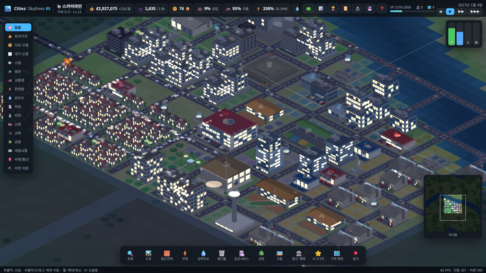
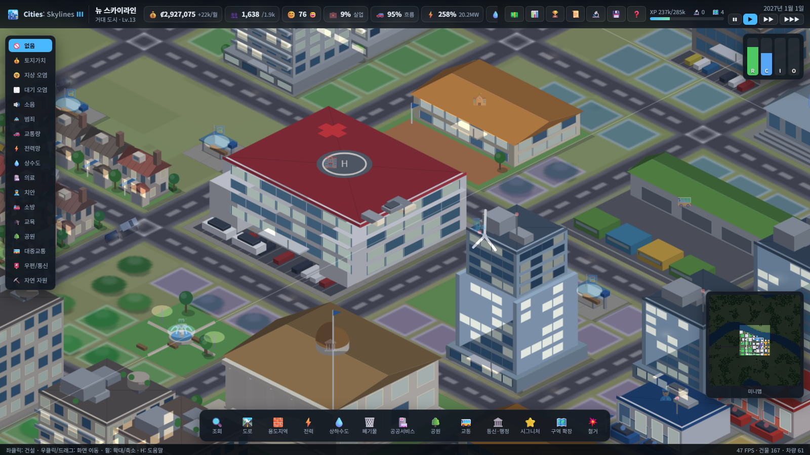
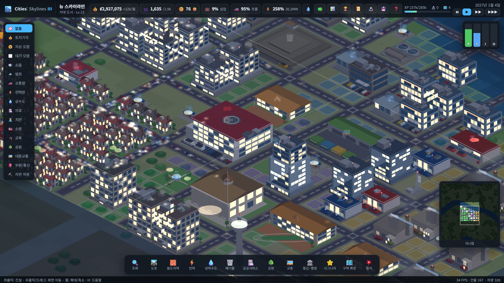
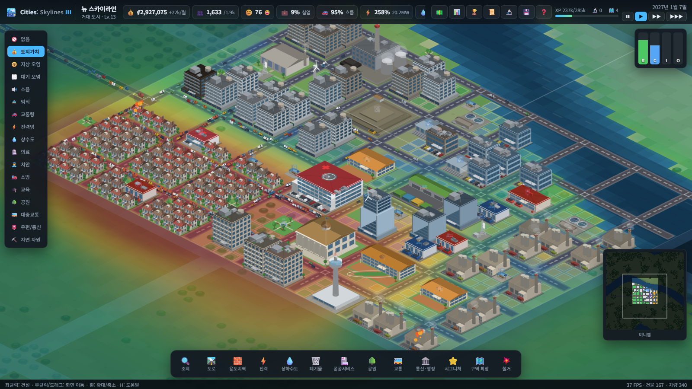

# 🏙️ Cities: Skylines III

**시티즈: 스카이라인 II**의 후속작을 콘셉트로 만든, 브라우저에서 바로 돌아가는
아이소메트릭 도시 건설 시뮬레이션 게임입니다.
빌드 도구·외부 라이브러리 없이 순수 HTML5 Canvas + ES 모듈로 구현했습니다.



| 근접 뷰 | 야간 |
|---|---|
|  |  |

---

## 실행

```bash
npm start          # http://localhost:8123 접속
```

> 정적 파일 서버만 필요합니다. `python3 -m http.server 8123` 로 열어도 동일하게 동작합니다.
> (ES 모듈을 쓰기 때문에 `index.html` 을 파일로 직접 여는 것은 브라우저 CORS 정책상 불가합니다.)

### URL 옵션

| 파라미터 | 설명 |
|---|---|
| `?demo=12` | 12개월치를 시뮬레이션한 데모 도시를 즉시 생성 |
| `?seed=7` | 맵 시드 고정 |
| `?zoom=1.5` | 시작 확대 배율 |
| `?overlay=land` | 시작 정보 오버레이 (`land`, `traffic`, `air`, `power` …) |
| `?night=0.85` | 시각 고정 (0=한낮, 1=한밤) |
| `?tab=edu` | 시작 시 특정 툴바 탭 열기 |
| `?selftest=1` | 전 기능 자동 점검 실행 후 결과 표시 |
| `?nohelp=1` `?auto=0` | 도움말 창 / 자동저장 이어하기 건너뛰기 |

---

## 게임 시스템

### 🛣️ 도로와 인프라
- **2차선 도로 · 4차선 도로 · 6차선 대로 · 고속도로** 4종. 통행 용량·속도·소음이 각각 다릅니다.
- CS2와 동일하게 **전선과 상하수도관은 도로 밑에 함께 매설**됩니다.
  발전소·취수장을 도로에 연결하면 그 도로망 전체에 전기와 물이 공급됩니다.
- 멀리 떨어진 도로망은 **송전탑**으로 연결합니다.
- 도로 위에 다리를 놓아 강을 건널 수 있습니다(건설비 4배).

### 🧱 용도지역 (Zoning)
| 구역 | 해금 | 건물 크기 | 최대 수용(Lv.5) |
|---|---|---|---|
| 저밀도 주거 | 시작 | 1×1 | 12명 |
| 중밀도 주거 | 마일스톤 4 | 2×2 | 68명 |
| 고밀도 주거 | 마일스톤 9 | 2×2 | 172명 |
| 저밀도 상업 | 시작 | 1×1 | 14 일자리 |
| 고밀도 상업 | 마일스톤 10 | 2×2 | 80 일자리 |
| 산업 | 시작 | 2×2 | 82 일자리 |
| 사무 | 마일스톤 12 | 2×2 | 76 일자리 |

건물은 **도로에서 2칸 이내**에 자동으로 지어지고, **토지가치**가 오르면 레벨 1→5로 성장합니다.
불만이 오래 쌓이면 건물이 버려지고(🏚️), 소방 서비스가 닿지 않으면 화재가 발생합니다(🔥).

### 🏢 서비스 시설 (40여 종)
전력(풍력·석탄·가스·태양광·원자력) · 상하수도 · 폐기물(매립지·소각장·재활용) ·
의료 · 소방 · 경찰 · 교육(초/고/대학·도서관) · 공원 · 대중교통(버스·지하철·화물터미널) ·
우편/통신 · 시청/복지부 · 시그니처 건축물(전망타워·경기장·컨벤션센터·공항).

### 🏗️ 건물 디자인 (절차적 건축)
모든 건물은 스프라이트가 아니라 **코드로 매번 새로 짓습니다**. 용도지역·레벨·변종 시드에서
매스(덩어리)와 파사드, 옥상 설비, 부지 조경까지 결정론적으로 생성합니다.

- **매스와 셋백** — 고밀도 주거·사무 타워는 저층 포디움 + 상부 셋백, 모서리 기둥으로 구성
- **파사드** — 개별 창(punched window) / 가로 띠창(ribbon) / 커튼월 3가지 유형, 멀리언과 창틀
- **저층부** — 쇼윈도, 천막 차양, 간판 띠, 입구 캐노피, 현관 포치와 기둥
- **발코니** — 중·고밀도 주거는 층마다 연속 발코니와 난간
- **옥상** — 파라펫과 방수 데크, 실외기 군, 물탱크, 계단탑, 통신 안테나(항공 장애등),
  태양광 패널, 옥상 정원, 헬리패드
- **부지** — 주차장(구획선 + 주차된 차량), 진입로, 차고, 울타리, 생울타리, 정원수, 보도블록
- **레벨 진행** — CS2와 같이 **2단계마다 외형이 바뀝니다**.
  저밀도 주거는 트레일러 → 단층 주택 → 차고 딸린 주택 → 도머창 2층집 → 정원·수영장까지 발전하고,
  고층 건물은 레벨이 오를수록 유리 비중과 셋백, 옥상 설비가 늘어납니다.
- **서비스 건물 42종 전용 모델** — 냉각탑과 굴뚝을 갖춘 화력발전소, 격납 돔의 원자력발전소,
  회전하는 풍력 블레이드, 다리 위 물탱크, 원형 침전지의 하수처리장, 계단식 매립지,
  톱니 지붕과 사일로의 공장, 갠트리 크레인의 화물터미널, 관중석과 조명탑의 경기장,
  활주로·관제탑·계류 여객기의 공항, 열주와 돔의 시청 등
- **애니메이션** — 굴뚝 매연/수증기, 풍력 발전기 회전, 화재 불길과 연기, 건설 현장의 타워크레인
- **야간 조명** — 창문이 무작위로 켜지고, 가로등 광원과 차량 전조등, 항공 장애등이 가산 합성됩니다.
  낮/밤은 **시뮬레이션 속도와 무관한 실시간 5분 주기**로 아주 천천히 돕니다
  (게임 내 하루는 1초 남짓이라 그대로 쓰면 화면이 초 단위로 깜박입니다).
  상단 🌗 버튼이나 `N` 키로 **자동 · 낮 고정 · 밤 고정**을 전환할 수 있습니다

### 📈 시뮬레이션
- **교통** — 실제 도로망 위에서 A\* 경로탐색으로 통근 통행을 배분합니다.
  혼잡도가 경로 비용에 반영되어 정체가 우회 경로를 만들고, 화면에는 차량이 실제로 그 경로를 달립니다.
- **시민** — 유아/청소년/성인/노인 연령 구조와 저·중·고 학력 구조를 추적합니다.
  학교 도달률에 따라 학력이 올라가고, 학력에 맞는 일자리에 취업합니다(하향 취업 포함).
- **환경** — 지상오염·대기오염·소음이 확산 시뮬레이션되고 토지가치와 건강을 깎습니다.
- **토지가치** — 공원·서비스 도달률·수변·주변 건물 등급은 올리고, 오염·소음·범죄는 내립니다.
  건물 레벨업의 핵심 지표입니다.
- **경제** — 구역별 세율, 전기/수도/쓰레기 사용료, 서비스별 예산 배율, 대출과 이자.
- **수요(RCI-O)** — 실업률 피드백이 들어 있어 일자리가 모자라면 상업·산업 수요가,
  집이 모자라면 주거 수요가 자동으로 올라갑니다.

### 🏆 진행
CS2와 같은 **20단계 마일스톤**(개척지 → 메갈로폴리스). 인구·만족도와 건설 활동으로
**확장 포인트(XP)** 를 얻고, 마일스톤마다 자금·**개발 포인트**·**확장 허가증**을 받습니다.
- 개발 포인트 → 🔬 개발 트리에서 고급 시설 개방
- 확장 허가증 → 🗺️ 인접 구역(20×20칸) 구매, 최대 36개 구역

### 📜 정책
분리수거 의무화, 금연 정책, 교육 장려금, 대중교통 무료화, 산업 공해 규제,
소상공인 지원, 절전 캠페인, 태양광 보조금, 자전거 도로, 야간 순찰 강화,
임대료 상한제, 첨단산업 전환 — 총 12종.

---

## 조작

| 동작 | 키 |
|---|---|
| 화면 이동 | 우클릭 드래그 / `W` `A` `S` `D` |
| 확대·축소 | 마우스 휠 |
| 건설·구역 지정 | 좌클릭 드래그 |
| 도로 / 용도지역 / 철거 | `Q` / `E` / `X` |
| 브러시 크기 | `[` `]` |
| 일시정지 / 속도 | `Space` / `1` `2` `3` |
| 격자 표시 | `G` |
| 낮/밤 전환 (자동 · 낮 고정 · 밤 고정) | `N` |
| 예산 / 통계 / 마일스톤 / 정책 / 개발 / 도움말 | `B` `T` `M` `P` `R` `H` |

정보 오버레이 17종(토지가치·오염·소음·범죄·교통량·전력망·상수도·의료·치안·소방·교육·공원·
대중교통·우편통신·자연자원)을 왼쪽 패널에서 켤 수 있습니다.



---

## 저장

브라우저 `localStorage` 저장 슬롯 + 2분마다 자동저장, JSON 파일로 내보내기/불러오기를 지원합니다.
맵 격자는 Base64 인코딩된 TypedArray로 직렬화됩니다.

---

## 프로젝트 구조

```
index.html            UI 셸
styles.css            UI 스타일
src/
  main.js             게임 루프, 진입점
  save.js             저장/불러오기 직렬화
  demo.js             데모 도시 생성기 (?demo=1)
  selftest.js         브라우저 자동 점검 (?selftest=1)
  core/
    config.js         밸런스·건물·마일스톤·정책 데이터 전체
    world.js          맵 상태, 지형 생성, 타일/건물 조작
    utils.js          시드 난수, 노이즈, 힙, 포맷터
  sim/                (DOM 비의존 — Node에서 그대로 실행 가능)
    simulation.js     틱 오케스트레이션 (일/월 경계)
    network.js        도로망 컴포넌트, A* 경로탐색, 교통 배분, 차량
    fields.js         서비스 커버리지·오염·소음·범죄·토지가치 필드
    economy.js        전력/수도/하수/쓰레기, 인구·고용·교육, 수요, 예산
    growth.js         용도지역 건물 신축·입주·레벨업·쇠퇴·화재
    progression.js    XP·마일스톤·개발 포인트·구역 확장
    actions.js        플레이어 액션(건설/지정/철거) 및 규칙 검사
  render/
    gfx.js            카메라, 아이소메트릭 변환, 색상, 시드 난수
    ground.js         지면 텍스처(그리드 공간 → 아이소 행렬 투영, 부분 갱신)
    architecture.js   건축 프리미티브(상자·원기둥·박공지붕·파사드·옥상 설비)
    models.js         용도지역 7종 + 서비스 42종의 절차적 건물 모델
    sprites.js        건물 스프라이트 캐시(확대 단계별, 본체/야간 조명 분리)
    renderer.js       스프라이트 합성·차량·야간 조명·오버레이·프리뷰
  ui/
    ui.js             상단바·툴바·정보패널·미니맵·모달
    input.js          마우스/키보드, 도구 적용, 프리뷰
tools/
  serve.mjs           의존성 없는 정적 서버
  smoketest.mjs       Node 시뮬레이션 스모크 테스트
  balance.mjs         시나리오별 밸런스 리포트
```

### 렌더링 방식
**지면** — 아이소메트릭 투영은 선형 변환이므로, 지면을 *그리드 공간의 텍스처 한 장*에 그린 뒤
`ctx.setTransform` 으로 통째로 투영합니다. 지형·도로·구역이 바뀐 사각 영역만 다시 그리므로
120×120 = 14,400 타일 맵도 프레임당 이미지 한 번만 그리면 됩니다.

**건물** — 건물 한 채의 디테일은 수십~수백 개의 폴리곤이라 매 프레임 그리면 감당이 안 됩니다.
그래서 `(종류, 레벨, 변종, 상태)` 조합마다 **확대 단계별로 한 번만** 오프스크린 캔버스에 그려 두고
이후에는 `drawImage` 한 번으로 블릿합니다(LRU 220장, 확대 단계가 바뀌면 폐기).
건물마다 **본체 캔버스**와 **야간 조명 캔버스**를 따로 만들어, 밤에는 화면 전체에 야간 틴트를 덮은 뒤
조명 캔버스만 `lighter` 합성으로 얹습니다. 덕분에 창문 하나하나가 켜지는 야경을 공짜에 가깝게 얻습니다.
건설 중인 건물, 불타는 건물, 굴뚝 연기, 풍력 블레이드처럼 매 프레임 변하는 것만 직접 그립니다.

---

## 테스트

```bash
npm test                       # Node 시뮬레이션 스모크 테스트 (9개 단언)
node tools/balance.mjs         # 시나리오별 밸런스 리포트
# 브라우저 전 기능 점검 (39개 항목 — 건물 모델 147종 렌더링·툴바 팔레트·낮밤 주기 검증 포함)
open "http://localhost:8123/?selftest=1&auto=0&nohelp=1"
```

시뮬레이션은 시드 기반 난수를 쓰므로 같은 시드·같은 조작이면 **결정론적으로 재현**됩니다.

---

## 라이선스

MIT. Cities: Skylines는 Colossal Order / Paradox Interactive의 상표이며,
이 프로젝트는 해당 게임에서 영감을 받은 비상업적 팬 구현물입니다.
